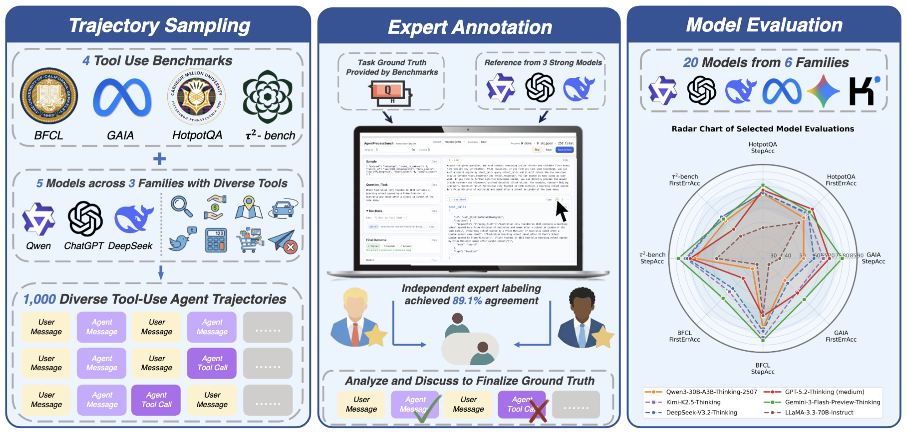
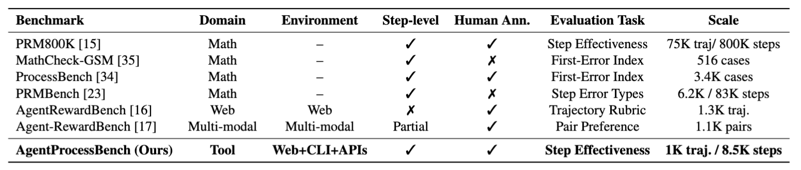
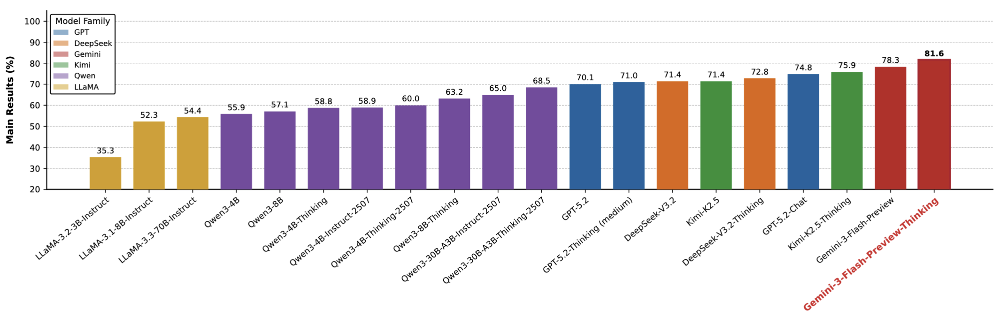

# AgentProcessBench: Diagnosing Step-Level Process Quality in Tool-Using Agents



AgentProcessBench is a benchmark for **process-level evaluation of agent trajectories**.
Each trajectory contains multi-turn messages and tool interactions, and the target is to predict step-wise process labels.

## 👀 Overview

AgentProcessBench contains `1000` trajectories (`4` datasets × `250` samples) from `hotpotqa`, `gaia_dev`, `bfcl`, and `tau2`.
It evaluates whether a model can make reliable step-level process judgments under a unified protocol.
To support this benchmark, we built a dedicated data annotation platform in `annotation_platform/`.

The figure below reports cross-setting comparisons, showing relative strengths and weaknesses across datasets.



The next figure summarizes overall performance, giving a compact view of aggregate step-level effectiveness.



## 📑 Quick Start

### Data Access

- Local benchmark data: `data/AgentProcessBench/`

### Run Evaluation

Full benchmark:

```bash
cd /path/to/AgentProcessBench
export OPENAI_BASE_URL="your_api_url"
export OPENAI_API_KEY="your_api_key"
bash eval/eval.sh --model deepseek-chat --concurrency 8
```

Subset example:

```bash
bash eval/eval.sh --model deepseek-chat --datasets hotpotqa --start 0 --end 50 --concurrency 8
```

### Evaluation Outputs

All outputs are written under `eval/yourresults/`:

- predictions: `eval/yourresults/<run_name>/*.jsonl`
- raw judge logs: `eval/yourresults/_raw/<run_name>/*.jsonl`
- score table: `eval/yourresults/<run_name>/score.txt`

Printed metrics include:

- per-dataset: `step_micro_acc`, `firsterroracc`
- overall (AVG): `step_micro_acc`, `firsterroracc`
